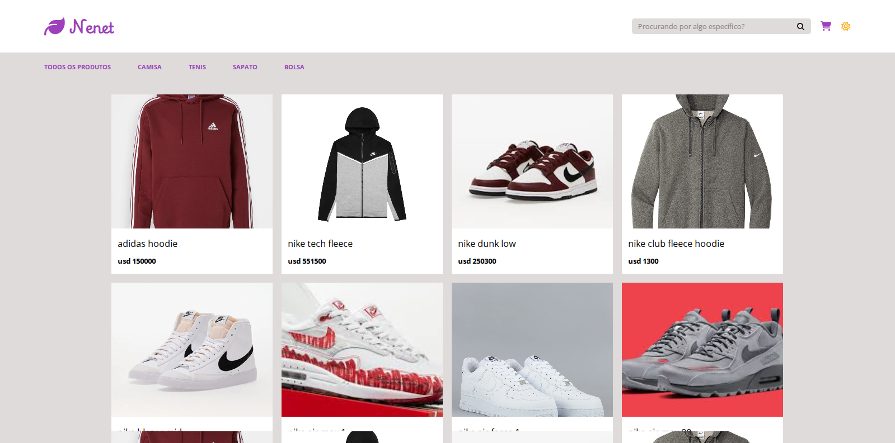
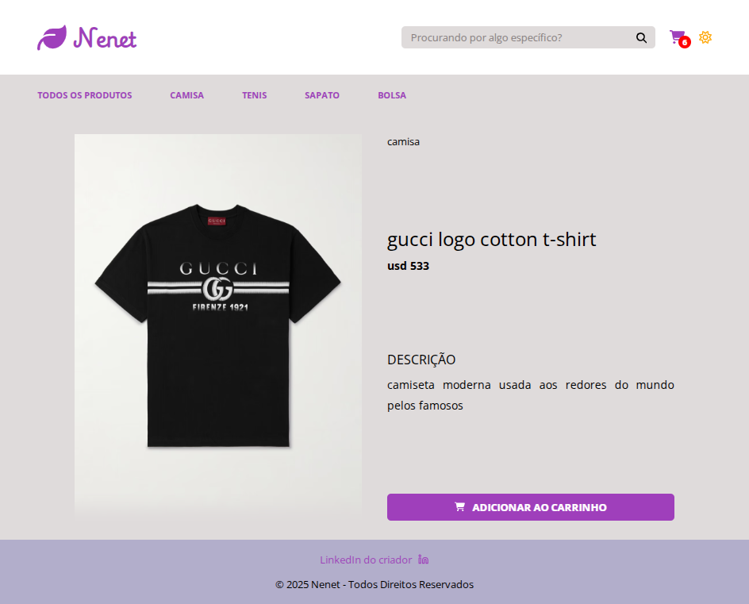
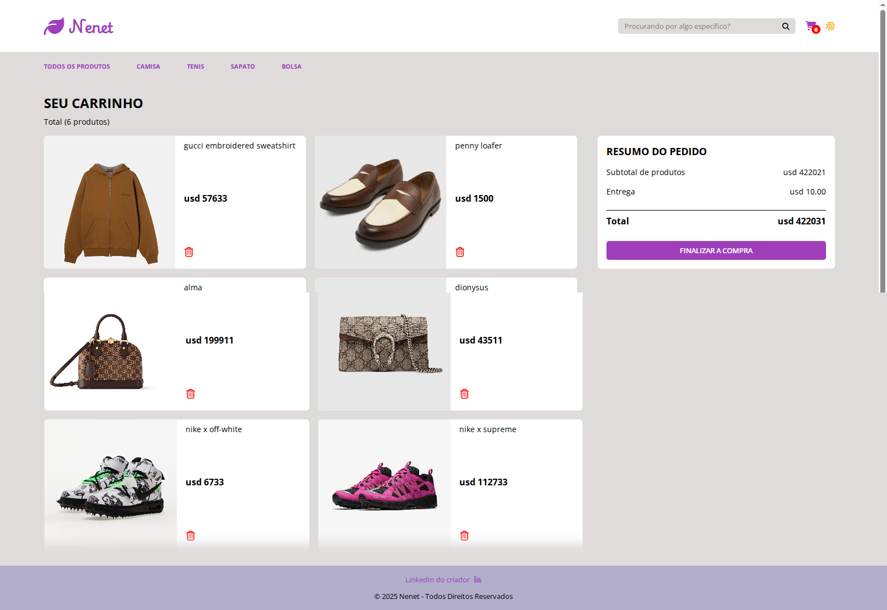

# 🛍️ Neneth E-commerce

Esta é uma documentação completa que você pode usar e adaptar no seu arquivo README.md.

### Visão Geral

Este é um projeto de **E-commerce moderno e responsivo** construído integralmente com **ReactJS**. Ele simula o fluxo de compra de ponta a ponta, desde a listagem de produtos até a finalização do pedido, utilizando tecnologias atuais para gerenciamento de estado e requisições assíncronas.







## ⚙️ Tecnologias Utilizadas

O projeto foi desenvolvido com foco em performance e uma experiência de usuário (UX) fluida.

| Categoria | Tecnologia | Finalidade |
| :--- | :--- | :--- |
| Front-end Principal | ReactJS | Biblioteca principal para a construção da interface de usuário. |
| Criação de Projeto | Vite | Ferramenta de build rápida para o ambiente de desenvolvimento. |
| Estilização | CSS Puro | Estilização limpa e personalizada, sem o uso de bibliotecas externas. | 
| Roteamento | React Router DOM | Gerenciamento das rotas de navegação entre as páginas. |
| Gerenciamento de Dados | React Query (TanStack Query) | Gerenciamento, cache e sincronização de estado de servidor (Server State Management). |
| Pagamentos | Stripe.js | Integração para simulação de checkout e processamento de pagamentos. | 
| Persistência Local | localStorage | Armazenamento temporário dos itens do carrinho (estado de persistência). |

## ✨ Funcionalidades Principais

O e-commerce oferece um conjunto completo de funcionalidades de compra:

- **Listagem de Produtos**: Exibe todos os produtos disponíveis, com a opção de paginação ou rolagem infinita (dependendo da implementação).
- **Filtro por Categoria**: Permite que o usuário refine a busca, exibindo apenas produtos de uma categoria específica.
- **Visualização de Detalhes do Produto**: Uma página dedicada para cada produto, exibindo descrição completa, imagens, e informações técnicas.
- **Adição ao Carrinho**: Adiciona produtos à lista de compras, com persistência dos itens via **localStorage**.
- **Checkout e Finalização da Compra**: Fluxo de pagamento simulado, integrado com a API do Stripe.js para uma experiência de compra realista.

## 💻 Como Instalar e Rodar o Projeto

Siga os passos abaixo para ter uma cópia do projeto rodando localmente em sua máquina.

**Pré-requisitos**

Você precisará ter o **Node.js** e o **npm** (ou **Yarn**) instalados.

**Instalação**

- **Clone o repositório:**

```Bash
git clone [SUA_URL_DO_REPOSITÓRIO]
cd [NOME_DO_SEU_PROJETO]
```

- **Instale as dependências:**

```Bash
npm install 
# ou
yarn install
```

- **Inicie o Servidor de Desenvolvimento:**

```Bash
npm run dev
# ou
yarn dev
```

O aplicativo será aberto automaticamente em **http://localhost:5173**.

## 🤝 Contribuição

Contribuições são **muito bem-vindas**! Se você tem ideias para melhorias, novas funcionalidades ou correção de bugs, sinta-se à vontade para:

- Fazer um Fork do projeto.
- Criar uma **Branch** para sua feature (**git checkout -b feature/AmazingFeature**).
- Comitar suas mudanças (**git commit -m 'Add some AmazingFeature'**).
- Fazer o Push para a Branch (**git push origin feature/AmazingFeature**).
- Abrir um Pull Request.